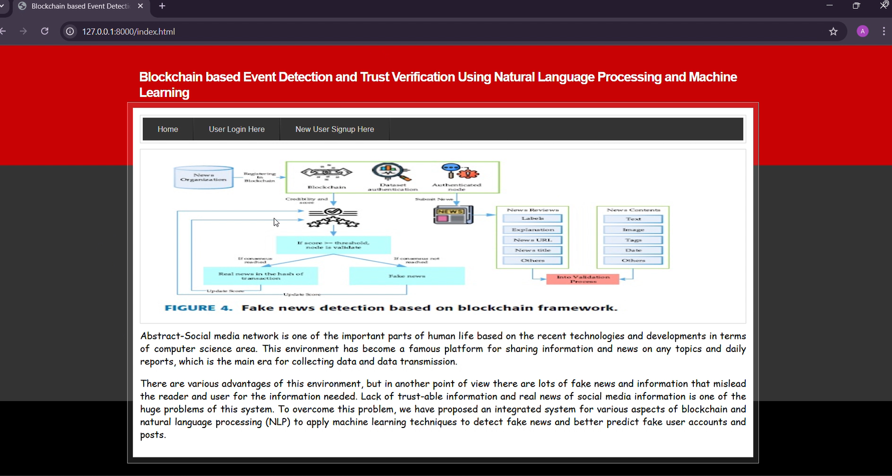
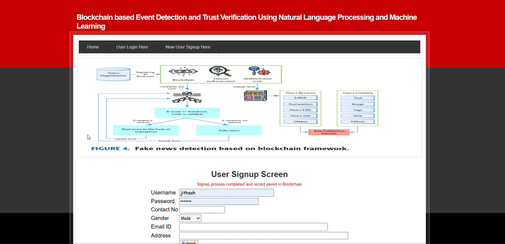
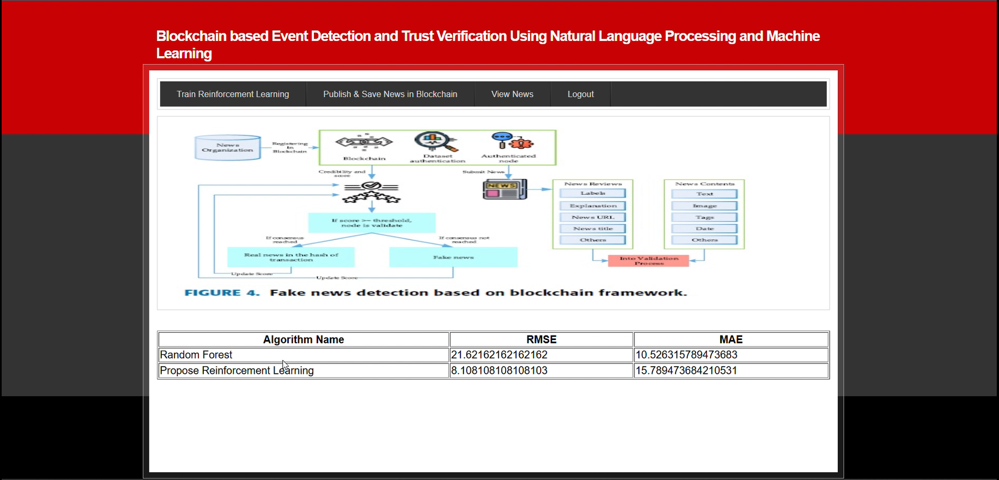
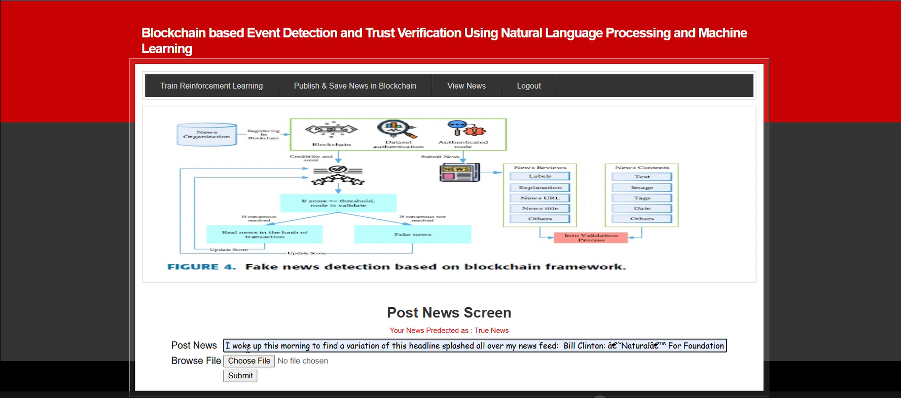

# Blockchain-Based Event Detection & Trust Verification

## Overview

This project focuses on detecting events and verifying trust using blockchain technology. It aims to enhance data integrity, transparency, and security by leveraging decentralized systems.

---

## Problem Statement

Traditional systems rely on centralized authorities, which can lead to:

* Data manipulation
* Lack of transparency
* Single point of failure

This project solves these issues using blockchain-based verification.

---

## Solution

A decentralized system that:

* Detects events in real-time
* Verifies trust using blockchain
* Ensures secure and tamper-proof data handling

---

## Tech Stack

* **Frontend:** (Add if you used React / HTML / etc.)
* **Backend:** Node.js
* **Blockchain:** (Ethereum / Smart Contracts if used)
* **Language:** JavaScript

---

## Features

* Event Detection System
* Trust Verification Mechanism
* Secure Data Processing
* Decentralized Architecture

---

## Project Structure

```
hello-eth/
│── src/
│── contracts/
│── scripts/
│── package.json
│── README.md
```

---

## 🚀 Installation & Setup

### 1.Clone the repository

```
git clone https://github.com/AymanRais/Blockchain-Based-Event-Detection-Trust-Verification.git
```

### 2.Navigate to project folder

```
cd hello-eth
```

### 3.Install dependencies

```
npm install
```

### 4.Run the project

```
npm start
```

---

## Screenshots

### Home Page


### Login Page


### ML Scoring


### Upload News


---

## Future Improvements

* Add UI dashboard
* Improve smart contract efficiency
* Integrate real-time analytics

---
